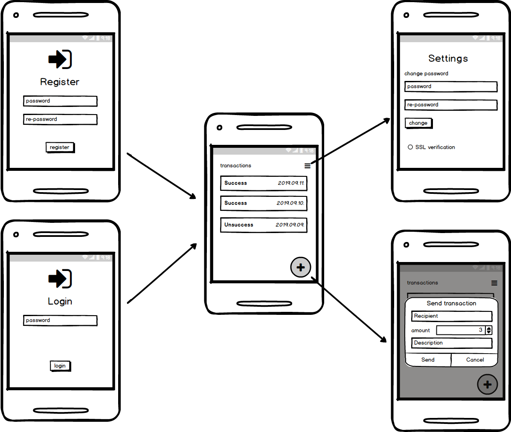

# VulnaBank

### defdev's Android development security exam app
This deliberately vulnerable application (DVA) is exam material used in the ‘Development security in Android' blue level course by Zsombor Kovács (huobb0). The application has some serious security issues while providing ‘life like’ functionality (of a conceptual banking app).

### Build/Run
Note, that the main purpose with this app is code review, so building and installation is possibly not the major concern in using it as a learning and practicing material.
- git clone (the 'main' branch is sufficient for the purpose)
- build and run

> This app still uses discontinued **Kotlin synthetics** for views which means that for successful builds the used project structure is target API 30, Java 11, Kotlin 1.7.21, Gradle plugin 7.4.2, Gradle 7.6.2, appcompat max 1.3.1, core-ktx max 1.6.0, material 1.4.0. Please ignore the suggestions to upgrade Gradle and deps versions.

### Technology stack

- Kotlin
- MVVM app architecture
- Room database implementation [room](https://developer.android.com/topic/libraries/architecture/room)
- encryption library for room, if it is needed in the future [safeRoom](https://github.com/commonsguy/cwac-saferoom)
- Dagger 2 dependency injection
- retrofit for server communication
- Lifecycle extensions
- Kotlin coroutines for background works

### Application overview

### Structure
##### UI Structure
- **TransactionApplication**: init the dependency injection and send LocalBroadcast when application comes foreground
- **LoginActivity**: control the registration and login flow depends on AuthRepository state (user already registered)
    - **RegisterFragment**: show the registration view content
    - **LoginFragment**: show the login view content
- **MainAcivity**: control the transaction list, settings and case when application comes foreground (catch the LocalBroadcast from Application)
    - **TransactionListFragment**: Main screen of the application. This UI shows the transaction list (query from local database and data published via viewModel). Pull to refresh implemented on this screen, but the list respond every transaction database changes. 
    - **TransactionInitFragment**: Transaction init dialog which access-able with + button from transaction list. Local data validation implemented on this screen. When user press the OK button, the typed values passed to transactionListFragment and main screen handles the transaction sending to back-end
    - **SettingsFragment**: PIN management and SSL settings change (change between http and https servers)

##### Singleton dependencies - *injected by DAGGER*
- **TransactionRepository**: SQLite database access interface
- **TransactionViewModelFactory**: Transaction UI controller module
- **AuthRepository with SharedPreferences**: Auth repository handles the registration, login, pin check and change via application shared preferences
- **CryptoUtil**: Crypto util provides the AES, RSA and pin MD5 hash encrypt and decrypt
- **TransactionService**: Retrofit communication module for transaction upload (contains OKHttp logging interceptor for logging post messages)
 
#### Use cases for testing
- **Registration and first run**
    - Install and run VulnaBank application
    - Type correct pins (only 4 characters accepted in password and re-password field -> Register button goes enabled)
    - When two pin is not equals, local validation shows error message in re-password field
- **Login**
    - Start the application
    - Type incorrect pin, press Login button, local validation error message shows
    - Type correct pin, press Login button, application enters the transaction screen
    - Send app to background with HOME button, select application from running apps, application shows the Login screen 
- **Send transaction**
    - Start and log into the application
    - Press + button at the bottom of the page
    - Press cancel in the dialog -> nothing happens 
    - Fill the form with correct data (name field is mandatory, amount should be > 0, account number must be > than 8 numbers, comment is optional)
    - Press OK -> application navigates back to transactions screen, progress dialog appears and transaction list refreshes with successful or unsuccessful transaction
- **Settings** 
    - Start and log into the application
    - Press the menu button on the top right corner
    - Try to change password -> local validation displays if the new pins is not equals 
    - Click to *TLS verification enabled* checkbox -> if it is selected, the application communicates via https (application restart needed)
    

### Credits
* Implemented by Ferenc Sági (sagifer)
* Idea and specification by Zsombor Kovács (huobb0)
* Photo by 'Science in HD' used under the Unsplash License; derived work by Ksenia Kotelnikova; original: Seamans Guard, Stagg Field, University of Chicago...Credit: U.S. Department of Energy, Historian's Office
* Fixed bugs on AndroidManifest.xml and TransactionInitDialogFragment.kt by Angga Arifandi (blackmenthor)
